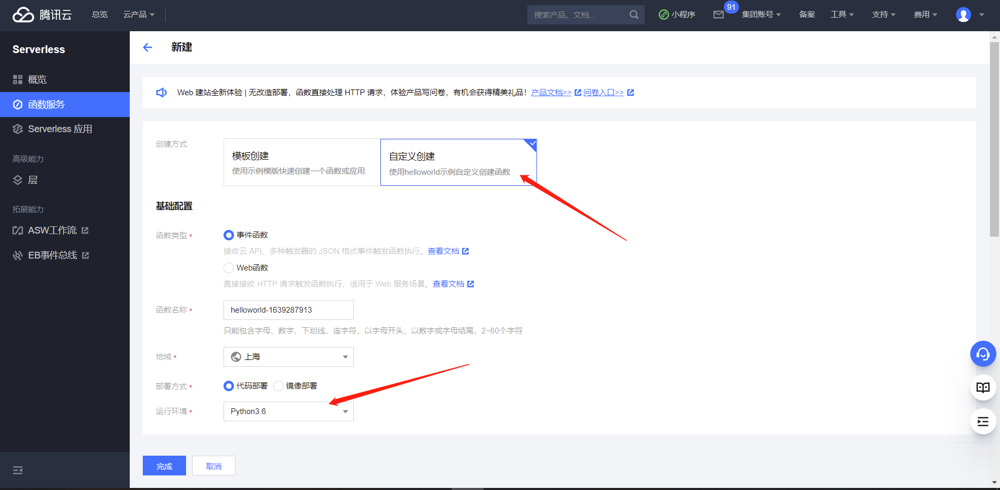

# Kunyu Serverless HOSTS collision configuration

First enter the configuration cloud function interface, select custom creation, the execution environment is Python 3.6, the region is fine, of course, it is best to choose the domestic location for the goal of China, and the function name is arbitrary



Fill in the function code, the specific code is as follows:


```python
# -*- coding: utf8 -*-
import requests

def main_handler(event, context):
    headers=event["headers"]
    ip = headers["ip"]
    header_new={
        "Host":headers["hosts"],
        "User-Agent":headers["user-agent"],
        "Accept-Encoding": "gzip, deflate",
        "Accept-Language": "zh-CN,zh;q=0.9,ko;q=0.8",
        "Connection":"close"
    }
    try:
        r = requests.get(ip,headers=header_new,timeout=10,verify=False)
        if r.status_code == 200:
            r.encoding = "gbk2312"
            return r.text
    except Exception as err:
        print(err)
        
    return False
```

In the advanced configuration, the execution timeout time is set to 10 seconds. If the timeout time is small by default, it may cause the failed request result to be returned.


Create a trigger, the specific configuration is as follows, pay attention to close the integrated response.


Edit the path of the API configuration to /, and then click Finish now


After the configuration is successful, the domain name of the API gateway is obtained as shown in the figure:


You can choose one of the two, copy it out and initialize it.

**Order:**

```
kunyu init --serverless "API gateway address"
```

Then perform the HOSTS blasting function normally.


**Example:**


**Situational Awareness Effect:**

